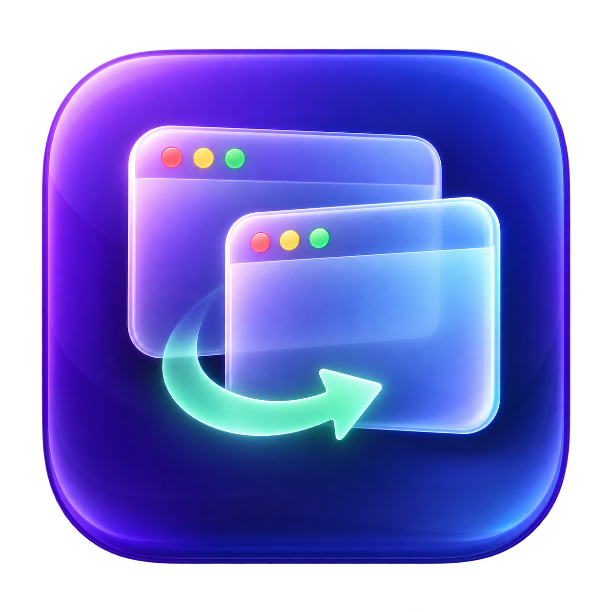

# WindowHop



[Download WindowHop](https://github.com/singhgit2023/WindowHop/releases/latest)

## Download and install

The initial downloadable build supports **Apple Silicon Macs** running macOS 13+. Thumbnails require macOS 14+. Intel users can build from source on their Mac.

Download the release ZIP, extract it, and move WindowHop.app to Applications before granting permissions. This free release is locally signed and **not Apple-notarized**; macOS may require approval in Privacy & Security before opening it. Review the source before choosing to run it.

Accessibility enables switching and Dock previews. Screen Recording is optional for thumbnails. Use the General settings panel for permission checks and recovery.

Updates are currently downloaded manually from GitHub Releases. Automatic update checks are not included in this version.


A native macOS menu bar app for switching between individual windows with **Option + Tab** (Alt + Tab on a PC keyboard). Built with Swift, AppKit, and SwiftUI. Requires macOS 13 or later; window thumbnails require macOS 14 or later.

## Build and run

Install Apple's Command Line Tools (`xcode-select --install`) if needed, then run:

```sh
./scripts/build.sh
open dist/WindowHop.app
```

Set `WINDOWHOP_SIGNING_IDENTITY` to your own signing certificate, or `-` for ad-hoc development. The maintainer uses a persistent local certificate in an ignored `scripts/signing-identity.txt` file. The script builds for the current Mac architecture. It does not silently fall back to ad-hoc signing. For everyday use, move `dist/WindowHop.app` to Applications **before** granting permission. Distribution to other Macs requires your own Developer ID signing and notarization.

In the setup screen, click **Open System Settings** and enable WindowHop under **Privacy & Security → Accessibility**. If needed, add the app with the + button. WindowHop checks for permission automatically; quit and reopen it if the shortcut remains unavailable. Rebuilding or moving the app may require removing its old permission entry and adding it again.

To enable thumbnails on macOS 14+, click **Allow window previews** in WindowHop Settings and grant **Screen Recording** (called **Screen & System Audio Recording** on some macOS versions). Relaunch the app if macOS requests it. This is optional: the switcher continues with app icons when permission is missing. The Window previews toggle disables capture.

## Settings window

The resizable settings window has a searchable sidebar:

- **General:** live permissions, reconnect/restart controls, minimized-window inclusion, and thumbnail capture.
- **Dock Previews:** enable/disable Dock hover, adjust hover delay, and configure Dock card appearance.
- **Window Switcher:** adjust quick-switch delay and configure switcher card appearance independently.

General contains one System/Light/Dark theme for the entire app, including Settings and both preview types. The previous switcher theme is migrated when available. Each preview appearance profile saves automatically and includes Liquid/Frosted/Clear backgrounds, opacity, preview width/height, a 16:10 aspect-ratio lock, maximum columns, card spacing, unselected-card opacity, and rounded corners. A six-card sample grid updates in the settings page, showing wrapping, spacing, selection, and inactive opacity. Click a sample card to change selection; the grid scales down to fit. Panel geometry uses the new dimensions the next time it opens. Liquid uses layered translucent materials and highlights; it does not simulate optical refraction. Clear removes the blur layer. Minimum background opacity keeps controls legible.

## Permission status and recovery

Settings displays separate live Accessibility and Screen Recording statuses, plus the actual Option + Tab listener state. Checks run every 1.5 seconds and when WindowHop becomes active. Permission is requested only when you click its Enable button.

- **Enable in Settings / Open Settings** goes directly to the matching macOS privacy pane.
- **Recheck & reconnect** checks access and recreates the keyboard listener without a full restart.
- **Restart WindowHop** relaunches the current app and opens Settings again.
- **Enabled in Settings, but still not working?** includes recovery steps and **Show app in Finder**, which selects the exact running copy for adding to the permission list.

macOS controls permissions; the app cannot grant them itself. Builds now use the persistent WindowHop Development certificate created in your login keychain. Keep that certificate and its private key: recreating it changes the identity. macOS may request keychain access the first time codesign uses the key. To deliberately select a different signing identity:

```sh
WINDOWHOP_SIGNING_IDENTITY='Developer ID Application: Your Name (TEAMID)' ./scripts/build.sh
```

Switching signing identities may itself require granting permissions again once. Keep the app at a consistent location. See [Apple's code-signing requirements](https://developer.apple.com/documentation/technotes/tn3127-inside-code-signing-requirements).

## Controls

| Action | Shortcut |
| --- | --- |
| Quick switch to previous window | Tap Option + Tab and release Option within 180 ms |
| Open / next window | Hold Option, press Tab; picker appears after 180 ms |
| Previous window | Option + Shift + Tab |
| Choose window | Release Option, press Return, or click a card |
| Move selection | Arrow keys while the picker is open |
| Cancel | Escape |

Settings and Quit are available from the overlapping-windows icon in the menu bar. **Preview Switcher** shows sample cards for six seconds without requiring permission. The app must stay running for the shortcut to work. Add it to macOS Login Items manually if you want it to start at login.

## Dock previews and window actions

Hover over a running app's macOS Dock icon for the configured delay (300 ms by default) to show its windows. Move into the panel and click a thumbnail to focus that window. The panel dismisses after you move away, or press Escape. It supports bottom, left, and right Dock placement, and includes a short grace period to cross from the icon into the panel. Disable it with **Show previews on Dock hover** in Settings.

Both Dock previews and the Option + Tab picker include these controls on each card:

- **Red ×:** close that window using its normal close button.
- **Yellow −:** minimize the window (or restore it when already minimized).
- **Power:** quit the entire application normally, including its other windows. This never force-quits an app; the app can prompt to save documents or cancel quitting.

Dock previews stay open after Close, Minimize/Restore, and Quit, and refresh their cards as the app responds. After the last window closes or the app quits, the panel shows an empty state until you move away or press Escape. The Option + Tab picker still dismisses after an action to avoid an unintended switch when Option is released. An unsupported or rejected request gives a system beep. Hover previews require Accessibility access; image thumbnails additionally require Screen Recording permission. Nonrunning apps, folders, Trash, and apps with no eligible windows do not open a panel. Dock item detection depends on the Dock exposing its app URL through Accessibility. Auto-hidden Docks must first be revealed by moving to the screen edge.

## Behavior and limitations

- Lists standard windows exposed by each app's Accessibility API, including minimized windows by default. Turn that off in Settings.
- Tracks recently focused windows while WindowHop is running: the current window comes first and the previous window second, so a quick Option + Tab alternates between them. History resets when the app quits. Focus notifications track changes within an app as well as between apps; periodic polling is a fallback for apps that do not send notifications.
- Move the pointer over a card to select it, then release Option to switch. A stationary pointer does not override the keyboard selection when the picker opens.
- The window list refreshes in the background every 1.5 seconds; newly created or closed windows can briefly lag.
- Quick switches do not open the picker or start screen capture. Holding Option displays the horizontal grid after 180 ms. Escape cancels pending and visible pickers.
- Optional thumbnails load asynchronously when the picker opens and refresh about two seconds after each capture pass. Images stay in memory and are cleared on dismissal; no files, network traffic, audio capture, or accounts.
- Previews use ScreenCaptureKit on macOS 14+. Minimized, protected, unavailable, or ambiguously matched windows show app icons instead. Matching uses the owning app and window geometry/title; two indistinguishable windows deliberately keep their icons.
- Windows on other Spaces may appear if their app exposes them. macOS controls Space transitions. Apps with incomplete Accessibility support, system dialogs, and secure input contexts may not work with the switcher.
- If another utility already uses Option + Tab, disable that conflicting shortcut.

## Implementation

`Sources/WindowHop/main.swift` contains the menu bar lifecycle, setup and picker views, background Accessibility enumeration, and a Quartz event tap. Window focus uses app activation and the Accessibility raise action. The event callback does not enumerate windows.

`Sources/WindowHop/WindowPreviews.swift` handles conservative window matching and ScreenCaptureKit snapshots. `Sources/WindowHop/DockHover.swift` resolves Dock items using background Accessibility hit testing.

Apple API references: [Accessibility attributes](https://developer.apple.com/documentation/applicationservices/1462085-axuielementcopyattributevalue), [Quartz event taps](https://developer.apple.com/documentation/coregraphics/cgevent), [ScreenCaptureKit](https://developer.apple.com/documentation/screencapturekit/capturing-screen-content-in-macos).
